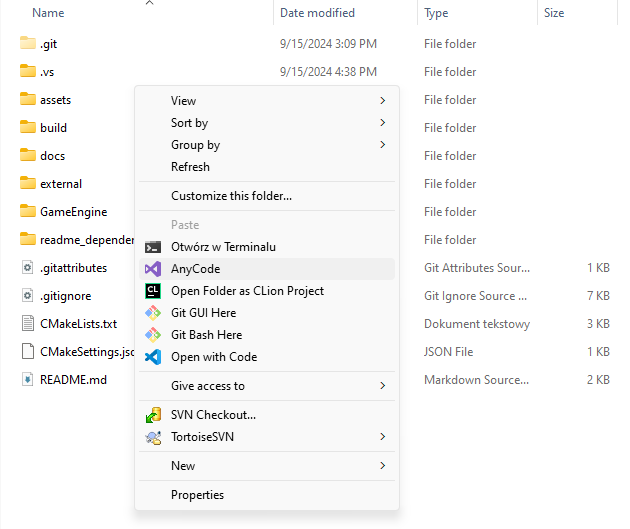
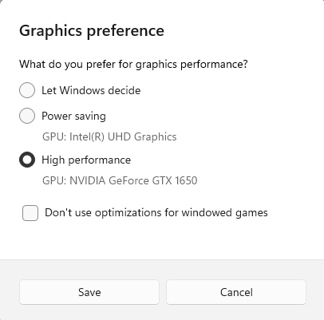
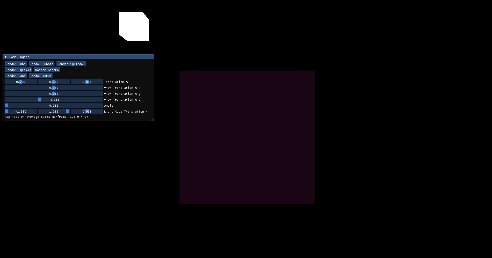
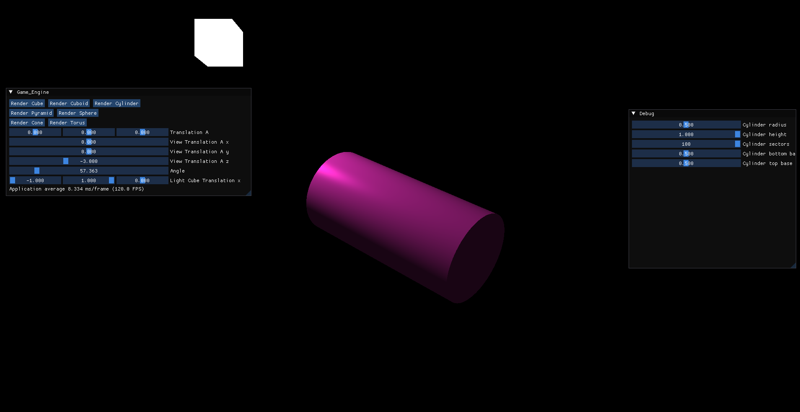

# Game Engine OpenGL TODO CHANGE NAME!!

## DESCRIPTION
TODO: create and change the name of project 
<name_of_project> is a simple game engine that renders some basic 3D objects. 
Using a GUI you can generate various 3D objects, execute transformation (such as rotating, translating, scaling), apply shaders and place custom textures. 
User can move around the scene using a camera and change the view with the mouse. 
There is also straightforward light physics (one source of light that affects the objects). 
The project is written in C++ and uses OpenGL, and other external libraries that are described [here](#external-libraries). 
This is also my bachelor's thesis project.
## INSTALLATION
   
### Prerequisites
- CMake
- C++ compiler
- OpenGL
- GLFW
- On Windows: Visual Studio 17
- On Linux: TODO
- On MacOS: TODO

### Build on windows
1. Clone the repository
2. Open the project in Visual Studio 17 

	- Wait a little bit to let cmake generate the project
	- (optional) Go to CMakeLists.txt in the main directory and use CTRL + S to make sure that the project is generated
3. Build and run the project (F5) 

#### In case of some artefacts:
**on Windows:**
- If you see some artefacts while running the program, it may be caused by running the program on the integrated graphics card.
- Make sure your PC runs this program with the dedicated graphics card.
- After building the project, check if in your directory is .exe file.
	* If no check if cmake is generated without any errors
- Go to Settings -> System -> Display -> Graphics
	- In "Custom options for apps" browse and search for Game_Engine.exe
	- Set option High Performance 
	

### Build on Linux
TODO

### Build on MacOS
TODO

## INSTRUCTION
After running the program there will be GUI with buttons that generate 3D objects.

Some objects can dynamically change their values (f.e. Cylinder).
If there are artifacts while changing object parameters go [here](#in-case-of-some-artifacts) for a quick fix.

To use translation on an object, use sliders that are below the rendering buttons.

### Keybinds
- T - Change objects shader (lightning shader, texture shader)
- C - Toggle camera mode. In this mode, the user can move around the scene.
- L - Toggle the object's mesh
- P - Toggle the object's vertices points

## EXTERNAL LIBRARIES

| Library | Description | Link |
| --- | --- | --- |
| GLAD | OpenGL loader | [GLAD](https://glad.dav1d.de/) |
| GLFW | Windowing library | [GLFW](https://www.glfw.org/) |
| GLM | Math library | [GLM](https://glm.g-truc.net/0.9.9/index.html) |
| STB image | Image loading library | [STB](https://github.com/nothings/stb/blob/master/stb_image.h)|
| IMGUI | GUI library | [IMGUI](https://github.com/ocornut/imgui)|
| ASSIMP | Model loading library | [ASSIMP](https://www.assimp.org/) |

## LICENSE
